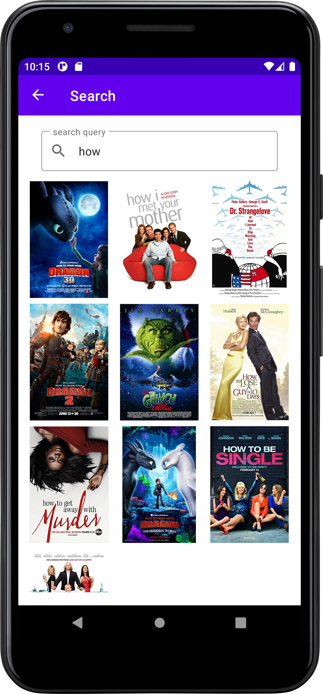
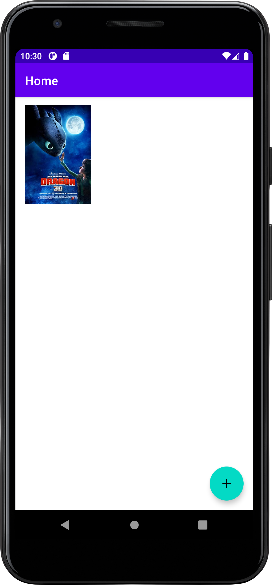
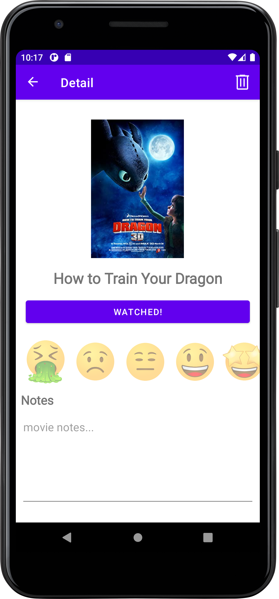
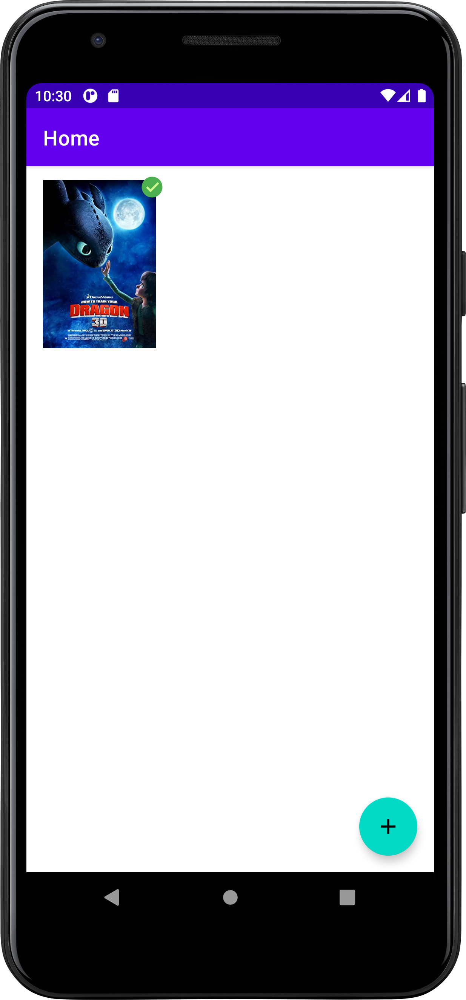

# WannaWatch
An android app that keeps track of the moves and tv shows I wanna watch

This app was built with `Kotlin` and was created to replace my ever growing list of recommended TV shows and movies

`OkHttp3` was used to make API calls to the OMDB API. This api is used for the search functionality and returns a json object containing
the movies IMDB id and a link to a poster image. The poster images are then fetched using `Coil`

Saved movies are persisted with `Room`.

## what's it look like?

<table>
  <tr>
    <td> </td>
    <td> </td>
   </tr> 
   <tr>
      <td></td>
      <td></td>
  </tr>
  <tr>
    <td></td>
  </tr>
</table>

Once you mark a movie as watched, the movie will show a green tick on the home screen showing the watched status
