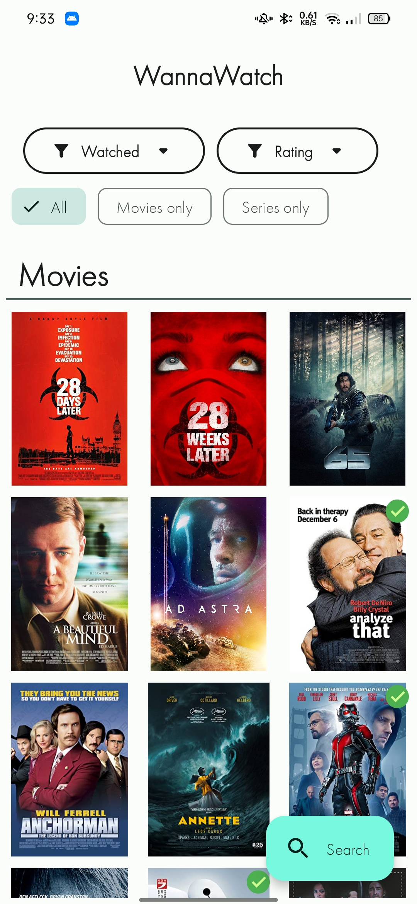
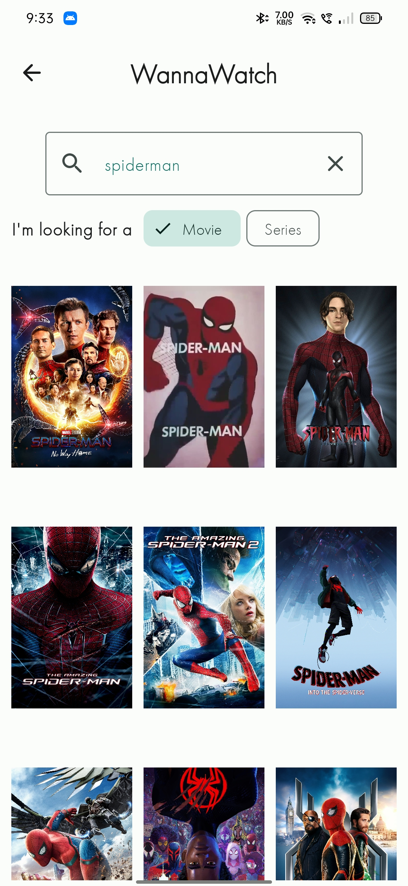
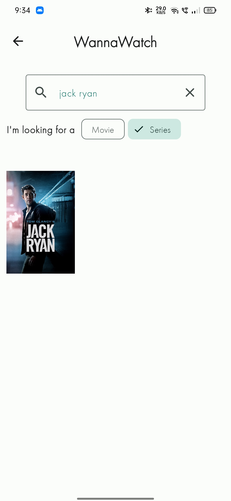
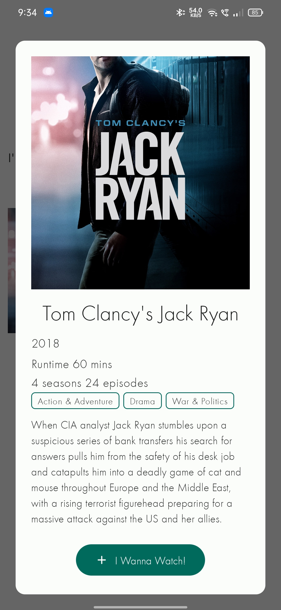
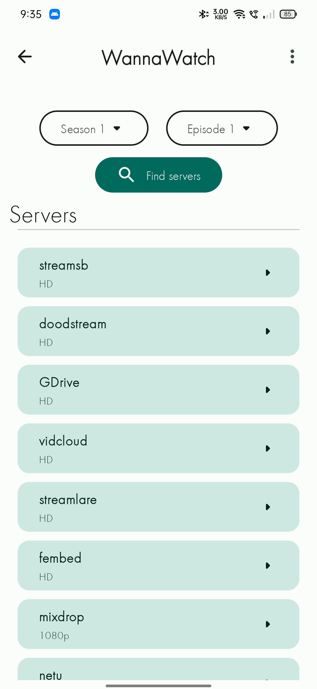

# WannaWatch
**An Android app that keeps track of the moves and tv shows I wanna watch**

This app was built with Kotlin and was created to replace my ever growing list of recommended TV shows and movies

The app was initally built with XML layouts (this version can be found on the [xml_version branch](https://github.com/Zed-Bailey/WannaWatch/tree/xml_version)) but with the new UI updated i decided to migrate it to compose and material 3.
I have found compose to be much nicer and far easier to iterate upon then XML layouts as the code is much more readable and intuitive.

Retrofit was used to create a service that can make API calls to the [TMDB](https://www.themoviedb.org/documentation/api) api

Okhttp3 was also used to make calls to the [super embed](https://www.superembed.stream/movie-streaming-api.html) api which hosts the links to the servers and embeddable video player

The compose lottie libray was also used to provide nice animations for loading over the boring circular spinner

Room is used for data persistance

# Improvements over v1?

Other then the major UI update this version also supports 
- filtering your added items by watched/unwatched and rating
- the ability to stream the shows and movies from in app 
- viewing data about the movie/show when searching

these were all popular demands

TMDB (the movie database) was also used over OMDB (open movie data base) as it provides more data on movies and shows 

# Future improvements?

- using hilt for dependency injection would help simplify the viewmodels
- streaming the videos and/or downloading vides from inside the app, no external browsers
- include more information in the search detail

# What's it look like?
The previous version can be found on the [xml_version branch](https://github.com/Zed-Bailey/WannaWatch/tree/xml_version) to compare ui differences

<table class="tg">
<tbody>
  <tr>
    <td class="tg-0lax" colspan="2">The home screen where you can see all your movies/tv shows. Watched items are marked with a green tick Also supports filtering to only show things that you have watched/unwatched by rating (1 star, 2 stars, etc..)  By selecting 'movies only' or 'series only' only items of that choice will be shown</td>
  </tr>
  <tr>
    <td class="tg-baqh" colspan="2"></td>
  </tr>
  <tr>
    <td class="tg-0lax" colspan="2">Search for movies or tv shows by selecting the appropriate filter chip</td>
  </tr>
  <tr>
    <td class="tg-baqh"></td>
    <td class="tg-baqh"></td>
  </tr>
  <tr>
    <td class="tg-0lax" colspan="2">View the movie or tv show's description, how many seasons or episodes it may have and the year it was released  once you have found your movie or show press the 'I wanna watch' button and the movie or show will be saved and can be found on your home page</td>
  </tr>
  <tr>
    <td class="tg-baqh"></td>
    <td class="tg-baqh"></td>
  </tr>
  <tr>
    <td class="tg-0lax" colspan="2">Click on any movie or show and you will be brought to the detail page where you can mark the item as watched, rate it with an emoji and write any notes on the movie or show. Clicking on the 'watch online' button will allow you to watch the media online</td>
  </tr>
  <tr>
    <td class="tg-baqh"></td>
  </tr>
  <tr>
    <td class="tg-0lax" colspan="2">if the item is a series then select a season and episode and press find servers select a server and a browser window will popup, streaming the movie or episode for you (would recommend installing an adblocker if you stream as some of the servers do show a lot of popups)</td>
  </tr>
  <tr>
    <td class="tg-baqh"></td>
    <td class="tg-baqh"></td>
  </tr>
</tbody>
</table>
